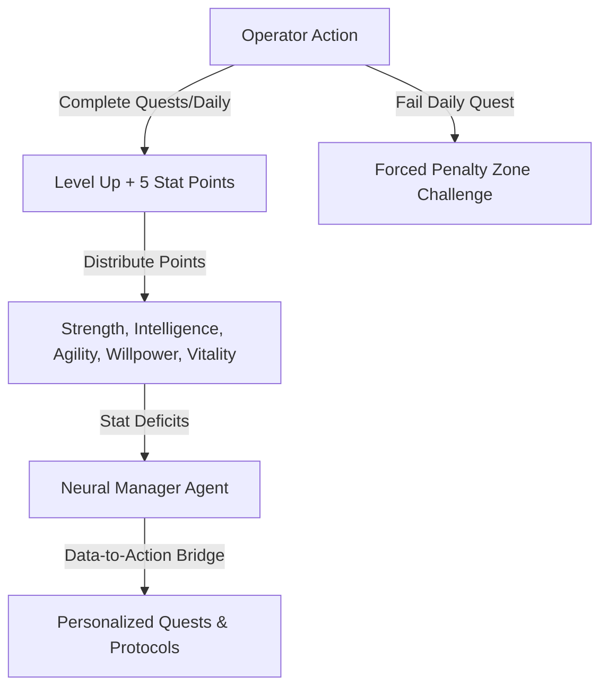

# Research & Design Proposal: Solo Leveling Gamified Productivity

This research document bridges actual user needs in the self-improvement/productivity space (culled from Reddit discussions, blogs, and reviews) with the gamified mechanics of the popular manhwa/anime **Solo Leveling**. It concludes with a proposed roadmap to refactor and expand the **NEXUS Self-Evolution System**.

---

## 1. What Users Actually Want (Reddit/Blog Synthesis)

Reddit communities like `r/productivity`, `r/getdisciplined`, and `r/selfimprovement` highlight several reasons why standard productivity apps fail:

### A. The "Productivity Paradox" (Configuration Bloat)
*   **The Issue**: Users spend hours customizing Notion templates, categorizing folders, and setting up complex boards. This acts as "productive procrastination." Once the setup is complete, the novelty fades, and the app is abandoned.
*   **The Need**: Extreme simplicity and a structured, zero-friction interface. The app should get out of the way and force action rather than setup.

### B. The Demoralizing "Zero-Streak" Trap
*   **The Issue**: Traditional apps reset streaks to zero if a single day is missed. This triggers the "what the hell" effect, where users feel completely discouraged and delete the app, or lie to it to keep a fake number.
*   **The Need**: Forgiving yet high-stakes accountability. Users need a "forgiving streak design" with grace systems, but with meaningful consequences (like penalties) that aren't just a simple reset.

### C. Manual Logging Friction
*   **The Issue**: Navigating menus to check off items and enter numerical data is tedious.
*   **The Need**: Natural Language Processing (NLP) or voice-to-text quick logs (e.g. typing or dictating: *"Did 100 pushups today"* and having the app parse and credit it automatically).

### D. Data without Action
*   **The Issue**: Apps track steps, habits, and tasks but leave it to the user to figure out what to do next.
*   **The Need**: A "data-to-action bridge" where the system analyzes current stat deficits and proactively recommends specific quests or training protocols.

---

## 2. Solo Leveling Inspiration as the Ultimate Solution

The game-like "System" in *Solo Leveling* directly addresses these psychological friction points:



### 1. The Daily Quest (Zero-Friction Baseline)
*   **Solo Leveling Mechanic**: Sung Jinwoo must do 100 pushups, 100 situps, 100 squats, and a 10km run every single day. No configuration, no options.
*   **Productivity Application**: A fixed, daily baseline discipline routine. It cannot be edited or bypassed. Complete it to maintain your baseline and earn +3 stat points.

### 2. The Stat Screen (Tangible Growth)
*   **Solo Leveling Mechanic**: Stats are divided into physical attributes (**Strength**, **Agility**, **Vitality**) and mental/sensory ones (**Intelligence**, **Perception/Willpower**). Leveling up yields 5 distributable stat points.
*   **Productivity Application**: Translating life actions into RPG attributes.
    *   *Strength/Vitality* = Physical workouts and sleep consistency.
    *   *Intelligence* = Reading books (quizzed by SAGE) and study focus blocks.
    *   *Agility/Time* = Speed, temporal optimization, and habit adherence.
    *   *Willpower* = Avoiding addictions and resisting bad habits.

### 3. The Penalty Zone (Alternative to Streak Reset)
*   **Solo Leveling Mechanic**: Failing the daily quest triggers a forced teleportation to a desert filled with giant sand centipedes, where the protagonist must survive for 4 hours.
*   **Productivity Application**: If a user fails their baseline daily tasks or lets their consistency score drop too low, the application locks down into **"PENALTY ZONE DETECTED."** The user cannot access the main dashboard, store, or console until they complete a high-intensity "Survival Protocol" (e.g., a physical workout or a 45-minute deep focus block) or pay a steep credit fine.

---

## 3. Proposal: The NEXUS Evolution Build & Fix Plan

To align the codebase with both user needs and the Solo Leveling theme, we will integrate and fix the application when you give the command.

### Phase 1: Core Bug Fixes & API Cleanup
*   **[FIX] Permanent Consistency Bug**: Modify the sliding 7-day consistency tracker in [GameContext.tsx](file:///C:/Users/JOTYAGNA/.gemini/antigravity/worktrees/NEXUS%20Self-Evolution/audit-codebase-bug-report/src/GameContext.tsx) to slide and clear old data correctly.
*   **[FIX] Robust JSON Parsing**: Introduce `parseJson` in `AgentBase.ts` to prevent Markdown formatting fences (e.g., ` ```json `) returned by Meta Llama from crashing the multi-agent system.
*   **[FIX] API Key Harmonization**: Connect `GEMINI_API_KEY` or `NVIDIA_API_KEY` cleanly, and add a setting block in the Profile component to let the user update their key without using the console.

### Phase 2: Feature Integration
*   **[NEW] Integrate Agent Console**: Bring back and integrate [AgentConsole.tsx](file:///C:/Users/JOTYAGNA/.gemini/antigravity/worktrees/NEXUS%20Self-Evolution/audit-codebase-bug-report/src/components/AgentConsole.tsx) into the navigation tabs, enabling direct, specialized conversations with SAGE, TITAN, and CHRONOS.
*   **[NEW] Integrate Shadow Self**: Implement the [ShadowSelf.tsx](file:///C:/Users/JOTYAGNA/.gemini/antigravity/worktrees/NEXUS%20Self-Evolution/audit-codebase-bug-report/src/components/ShadowSelf.tsx) mirror component to compare the user's stats against an aggressive AI "Shadow Self" that goads them into action.
*   **[NEW] Integrate App Block Panel**: Integrate [AppControlPanel.tsx](file:///C:/Users/JOTYAGNA/.gemini/antigravity/worktrees/NEXUS%20Self-Evolution/audit-codebase-bug-report/src/components/AppControlPanel.tsx) to let users toggle digital discipline filters.

### Phase 3: Solo Leveling & Psychology Refinements
*   **[NEW] The Penalty Zone Challenge**: Implement a lock-out screen that triggers upon quest failure. It forces the user to complete a survival task to regain access.
*   **[NEW] Natural Language Quick-Log (Voice / Text)**: Integrate the voice interface from [SupremeCommander.tsx](file:///C:/Users/JOTYAGNA/.gemini/antigravity/worktrees/NEXUS%20Self-Evolution/audit-codebase-bug-report/src/components/SupremeCommander.tsx) to support natural language logs (e.g. saying *"I did 50 squats"* to automatically log the action and increment agility/strength).
*   **[NEW] Data-to-Action Bridge**: Hook the AI agents to recommend specific training protocols based on the user's lowest stats.
